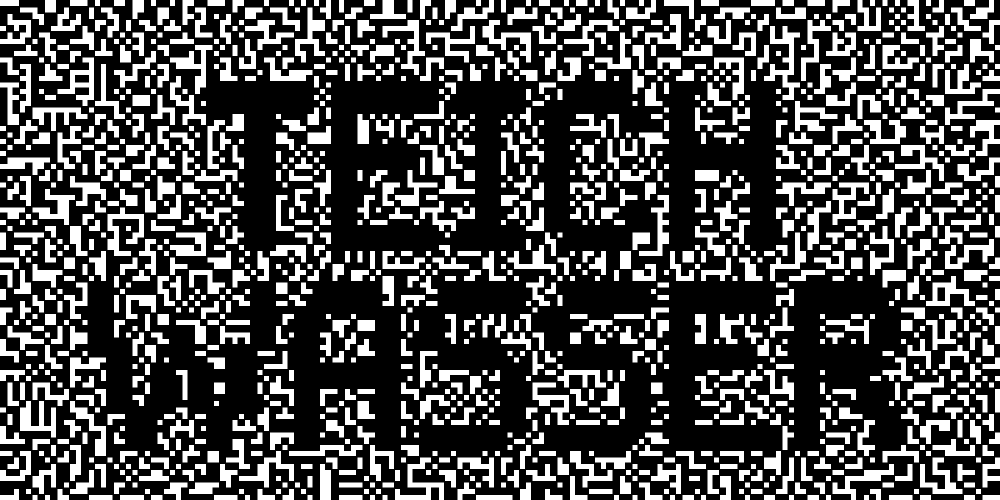

# Block Code generator

This is just a little program to encode text as two random images, showing the text when the two images are aligned. The first image is initialized to random pixels. For the second image, all pixels which should be black are inverted. When the two images are aligned, the black pixels from the second image cover the white pixels from the first image, and vice versa. The text is then visible.

## Quad Block Initialization

To reduce noise in the image, the first image is not initialized completely randomly. Instead, half of each group of 2x2 pixels are painted black.

## Usage

There is no real interface. Edit the variables at the top of the `Main.java` file. Then run the program. The images will be saved in the same directory as the program. I use the [Pixoletta8px ](https://www.dafont.com/pixolletta8px.font). The file is included in the repository.

## Sample Images

It uses Java and [JFree SVG](https://www.jfree.org/jfreesvg/)
